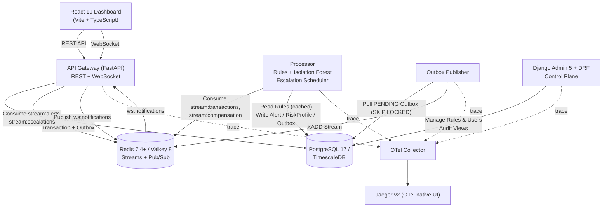
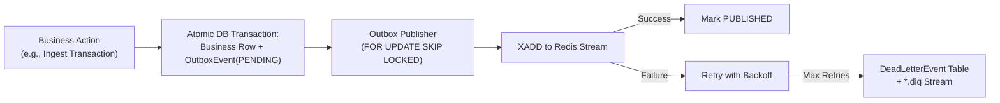
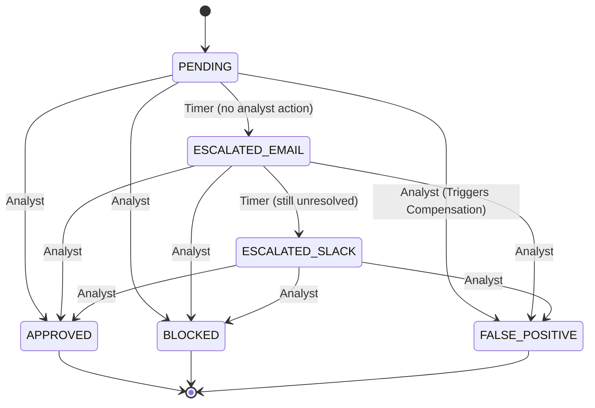

# RT-FADS — Real-Time Financial Anomaly Detection System

An event-driven microservices platform simulating high-throughput fraud surveillance for financial transactions, featuring a hybrid machine learning and rules engine, transactional outbox messaging, distributed tracing, and a real-time command-and-control dashboard.

---

## Architecture Overview

RT-FADS is built as an event-driven distributed system composed of runtime services, two durable backing stores, and an observability pipeline.



---

## Key Distributed Systems & Reliability Patterns

### 1. Transactional Outbox Pattern (Dual-Write Prevention)
To eliminate dual-write inconsistencies between PostgreSQL and Redis Streams, all state mutations (transaction submission, alert creation, alert resolution, escalation, and risk compensation) write business data and an `OutboxEvent` row within a **single atomic database transaction**. A dedicated, stateless **Outbox Publisher** relays pending events to Redis Streams using `SELECT ... FOR UPDATE SKIP LOCKED` and handles exponential backoff retries and Dead-Letter Queueing (DLQ).



### 2. Idempotent Event Consumers (Inbox Pattern)
All stream consumers (Processor, Notification Forwarder, Compensation Worker) are idempotent. Before applying any business effect, consumers check the `ProcessedEvent` table keyed on `event_id`. The business effect and the inbox record commit in the same transaction before acknowledging (`XACK`), guaranteeing correctness under at-least-once delivery and `XAUTOCLAIM` crash recovery.

### 3. Hybrid Anomaly Detection Pipeline
- **Deterministic Fraud Rules**: Configurable rule engine (`AMOUNT_THRESHOLD`, `HIGH_RISK_COUNTRY`, `VELOCITY` over TimescaleDB hypertable time-windows, `USER_RISK_LEVEL`, `MERCHANT_CATEGORY`) cached with TTL.
- **Unsupervised ML Model**: Pre-trained scikit-learn `IsolationForest` generating normalized anomaly scores `[0.0, 1.0]` over fixed feature vectors.
- **Composite Risk Scoring**: Weighted decision formula `(w_rule * rule_score + w_ml * ml_score + w_profile * user_risk)`. Alerts trigger if composite score $\ge 0.6$ or any rule has `CRITICAL` severity.
- **Isolated `DEMO_MODE`**: Demonstration overrides are isolated behind a single `DemoOverrideStrategy` pattern, preventing demo flags from contaminating core business logic.

### 4. Alert Resolution & Escalation State Machine
Alerts transition through non-terminal escalation states (`PENDING → ESCALATED_EMAIL → ESCALATED_SLACK`) via a background scheduler or resolve into terminal states (`APPROVED`, `BLOCKED`, `FALSE_POSITIVE`). Race conditions between concurrent analyst actions and the escalation scheduler are resolved via conditional updates (`UPDATE ... WHERE status = :expected`).



### 5. Real-Time WebSockets & REST Reconciliation
- **Redis Pub/Sub** is used strictly for ephemeral local fan-out (`ws:notifications`) to connected WebSocket clients.
- On reconnect, clients execute REST reconciliation (`GET /alerts?status=PENDING...`) to synchronize state missed during network disconnects.

---

## Tech Stack

| Domain | Technologies |
|---|---|
| **API Gateway** | Python 3.13+, FastAPI, Starlette, Pydantic v2, Uvicorn, SQLAlchemy (Async) |
| **Processor Worker** | Python 3.13+, FastAPI, scikit-learn (`IsolationForest`), NumPy, Redis-py |
| **Control Plane** | Python 3.13+, Django 5.2+, Django REST Framework (DRF), PostgreSQL ORM |
| **Frontend Dashboard** | React 19, TypeScript, Vite, CSS Custom Property Design Tokens, TanStack Query |
| **Databases & Messaging** | PostgreSQL 17 + TimescaleDB (Hypertables & Continuous Aggregates), Redis 7.4+ / Valkey 8 |
| **Observability** | OpenTelemetry Python/JS SDKs, OTel Collector, Jaeger Distributed Tracing |
| **Orchestration & Tools** | Docker Compose, Pytest, Faker, Alembic |

---

## Directory Structure

```
rt-financial-anomaly-detection-system/
├── frontend/                     # React 19 + TypeScript + Vite Dashboard
├── services/
│   ├── gateway/                  # FastAPI Gateway (Ingestion, WebSockets, Auth)
│   ├── processor/                # Detection Worker (Rules, ML, Escalation Scheduler)
│   ├── outbox_publisher/         # Outbox Polling & Redis Stream Relay Worker
│   └── admin/                    # Django Admin 5 + DRF Control Plane
├── shared/                       # Shared Python packages (Models, Event Envelope, Context)
├── infrastructure/               # otel-collector-config.yaml, Dockerfiles
├── scripts/                      # seed_data.py, simulate_live.py, train_model.py, verify_migrations.py
├── tests/                        # Unit, Integration, API Contract, E2E & Race Condition tests
├── models/                       # ML model artifacts (model.pkl, model_meta.json)
├── docker-compose.yml            # Docker Compose orchestration (Postgres, Redis, Jaeger, OTel)
├── .env.example                  # Environment configuration template
├── Makefile                      # Automation commands (make up, test, seed, simulate, etc.)
├── README.md
└── .gitignore
```

---

## Developer Workflow & Running the Project

### 1. Environment & Virtualenv Setup

```powershell
# 1. Copy environment template
cp .env.example .env

# 2. Create and activate virtual environment
python -m venv .venv

# On Windows PowerShell:
.\.venv\Scripts\Activate.ps1
# On Linux / macOS:
# source .venv/bin/activate

# 3. Install backend dependencies
pip install -r requirements.txt
```

---

### 2. Start Backing Infrastructure (Docker Compose)

Start PostgreSQL 17 (TimescaleDB), Redis 7.4+, Jaeger v2, and the OpenTelemetry Collector:

```powershell
docker compose up -d
# or: make up
```

Verify that all container health checks are passing:

```powershell
docker compose ps
# or: make health
```

---

### 3. Run Database Migrations & Verification

Apply Django migrations (admin/audit tables) and Alembic migrations (transactions hypertable, alerts, outbox):

```powershell
# 1. Run Django migrations
python services/admin/manage.py migrate

# 2. Run Alembic migrations
cd services/gateway
alembic upgrade head
cd ../..
# or: make migrate

# 3. Verify schema integrity and clean startup state
python scripts/verify_migrations.py
# or: make verify-db
```

---

### 4. Seed Baseline Data

Populate the database with $\ge 100$ synthetic users, $\ge 1,000$ historical transactions, and deterministic demo scenarios:

```powershell
python scripts/seed_data.py
# or: make seed
```

*(Note: Data seeding is strictly manual and never runs automatically on container boot).*

---

### 5. Train / Retrain ML Isolation Forest Model (Optional)

To retrain the unsupervised Isolation Forest anomaly detection model and calibrate normalization bounds:

```powershell
python scripts/train_model.py --samples 50000 --estimators 100 --contamination 0.05
# or: make train-model
```
Outputs model artifacts to `models/model.pkl` and `models/model_meta.json`.

---

### 6. Start the Microservices (Separate Terminals)

Run each service in a separate terminal with `.venv` activated:

#### Terminal 1: API Gateway (FastAPI Ingestion & WebSockets)
```powershell
python -m uvicorn services.gateway.main:app --port 8000 --reload
```
* **Swagger Documentation:** [http://localhost:8000/docs](http://localhost:8000/docs)
* **Health Check:** [http://localhost:8000/healthz](http://localhost:8000/healthz)

#### Terminal 2: Outbox Publisher Worker
```powershell
python -m services.outbox_publisher.main
```
* Relays pending events from PostgreSQL outbox to Redis Streams using `SELECT ... FOR UPDATE SKIP LOCKED`.

#### Terminal 3: Processor Worker (Hybrid ML & Rules Engine)
```powershell
python -m services.processor.main
```
* Consumes transaction events, executes rules + Isolation Forest ML inference, manages risk profiles, and runs the escalation scheduler.

#### Terminal 4: Django Admin Control Plane
```powershell
python services/admin/manage.py runserver 0.0.0.0:8001
```
* **Admin Portal:** [http://localhost:8001/admin/](http://localhost:8001/admin/)
* **Internal DRF API:** [http://localhost:8001/api/admin/](http://localhost:8001/api/admin/)

> **Tip (Create Admin User):**
> ```powershell
> python services/admin/manage.py createsuperuser
> ```

---

### 7. Run the Live Transaction Simulator

Stream continuous jittered financial transactions (normal & anomalous) into the running Gateway API:

```powershell
python scripts/simulate_live.py --interval-min 2.0 --interval-max 4.0 --anomalous-ratio 0.10
# or: make simulate
```
Press `Ctrl+C` anytime to display a live simulation summary report.

---

### 8. Run Automated Test Suite

Execute the full suite of unit, integration, race-condition, and contract tests:

```powershell
pytest tests/ -v
# or: make test
```

---

## API Reference

### 1. Gateway Public & Analyst API (`/api/v1`)

| Method | Endpoint | Auth | Purpose |
|---|---|---|---|
| `POST` | `/api/v1/transactions` | API Key | Ingest transaction asynchronously with idempotency |
| `GET` | `/api/v1/transactions/{id}` | API Key / JWT | Check transaction processing status |
| `GET` | `/api/v1/alerts` | JWT | List and filter alerts by severity, status, date |
| `GET` | `/api/v1/alerts/{id}` | JWT | Fetch alert detail with complete ML/rule explanations |
| `POST` | `/api/v1/alerts/{id}/approve` | JWT | Resolve alert as legitimate |
| `POST` | `/api/v1/alerts/{id}/block` | JWT | Resolve alert as confirmed fraud |
| `POST` | `/api/v1/alerts/{id}/false-positive` | JWT | Resolve alert as false-positive & trigger risk compensation |
| `GET` | `/api/v1/dashboard/summary` | JWT | Aggregate statistics & continuous aggregate chart data |
| `WS` | `/ws/alerts` | JWT (query/subprotocol) | Real-time push stream for alert updates and escalations |
| `GET` | `/healthz` / `/readyz` | None | Liveness and readiness probes |

---

### 2. Control Plane & Internal Surveillance API (`/api/admin`)

| Method | Endpoint | Purpose |
|---|---|---|
| `GET` | `/api/admin/fraud-rules/` | List and filter configured deterministic fraud rules |
| `GET` | `/api/admin/fraud-rules/{id}/` | Retrieve specific fraud rule details and parameters |
| `GET` | `/api/admin/audit-logs/` | Inspect immutable audit log trail of control plane mutations |
| `GET` | `/api/admin/users/` | List customer user accounts |
| `GET` | `/api/admin/alerts/` | Read-only view of detected alerts |
| `GET` | `/api/admin/transactions/` | Read-only surveillance view of ingested transactions |
| `GET` | `/api/admin/risk-profiles/` | Read-only view of customer risk scores and alert tallies |

---

## Observability & Distributed Tracing

Every ingested transaction is assigned a `correlation_id` (UUIDv4) that propagates across HTTP headers, database records, Redis event payloads, log lines, and OpenTelemetry trace spans. 

Traces can be inspected end-to-end in **Jaeger v2 (OTel-native UI)** at [http://localhost:16686](http://localhost:16686) covering:
$$\text{Gateway Ingestion} \longrightarrow \text{Outbox Relay} \longrightarrow \text{Processor Detection} \longrightarrow \text{Alert Creation} \longrightarrow \text{Notification Fan-out} \longrightarrow \text{WebSocket Broadcast}$$
